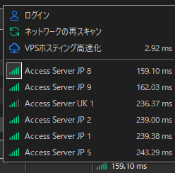

# AutoRecon (free)

MT4/MT5のサーバー接続を自動的に維持するインジケーターです。

MTのサーバー一覧には応答速度（ms）が表示されており、一番上が最速サーバーです。  
このインジケーターを使うと、ローソク足が生成されるたびに自動で再接続し、常に最速サーバーへ切り替わった状態を維持できます。

> 画像の例では「Access Server JP 8（159.10ms）」が最速。再接続するとこの一番上のサーバーに自動的につなぎ直されます。

## ダウンロード

[**こちらからダウンロード**](https://github.com/OgidaniLLC/linux-vps-portal/releases/tag/v-mql-latest) → `AutoRecon.zip`

> 解凍には [7-Zip](https://www.7-zip.org/) とパスワードが必要です。

---

## 対応プラットフォーム

| ファイル | 対応 |
|---|---|
| `AutoRecon(free).ex4` | MetaTrader 4 |
| `AutoRecon(free).ex5` | MetaTrader 5 |

---

## インストール

1. MT4/MT5を開き、メニューから **ファイル → データフォルダを開く**
2. `MQL4\Indicators\`（または `MQL5\Indicators\`）に `AutoRecon` フォルダごとコピー
3. MT4/MT5を再起動（またはナビゲーターを更新）
4. ナビゲーター → インジケーター → `AutoRecon(free)` をチャートにドラッグ

> **重要:** チャートに適用する際、「DLLの使用を許可する」にチェックを入れてください。

---

## 動作内容（無料版固定設定）

無料版はパラメーター変更不可の固定設定で動作します。

### 再接続
- ローソク足が生成されるたびに再接続（現在の時間足基準）

> **推奨時間足:** 1時間足〜4時間足  
> 短すぎる時間足（M1・M5など）では再接続が頻発し、チャートの動作に影響する場合があります。

### サーバー再スキャン
- 再スキャンなし（無効）

---

## 注意事項

- DLLの使用許可が必要です（user32.dll を使用）
- デモ口座・バックテスト中はログが出力されます（本番口座では非表示）
- 設定を変更したい場合は有料版をご利用ください

---

Copyright © 2023 OgidaniLLC. All rights reserved.  
https://www.ogidani.com